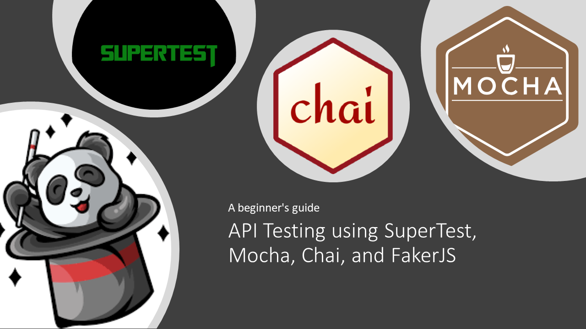

---
# API Testing using SuperTest, Mocha, and Chai

---

:Star: the project if you like the work.
##  the project if you like the work.

## Getting started

### Pre-requisites
* Download and install Node.js
* Download and install any Text Editor like Visual Code/Sublime/Brackets
* Initilize the project with default settings `npm init -y`
* Install dependencies `npm install --save-dev supertest mocha chai mochawesome @faker-js/faker`

### Setup Visual Code
* Install GitLens Extension from the Marketplace: `GitLens — Git supercharged by GitKraken`
* Go to Visual Code Preference > Setting and search `formatOnSave` and enable/ON it.

### Setup Git Repo 
* Clone the repository into a folder
* Go to Project root directory and install Dependency: `npm install`
* All the dependencies from package.json would be installed in node_modules folder.

### How to write Test
* Add new spec under `test-reqres-api` folder
* Name the file as <testname>.e2e.js (e.g. deleteTest.js)

### How to Run Test
* Go to Project root directory and run command: `npm test`
* If you want to run another set of api tests then run command: `npm run test-fakerest`

### How to Update local npm packages
* Go to Project root directory and run command: `npm update`

### How to view HTML report
* Go to Project root directory: `./allure-results/index.html`

### Sample Test Results

## :thought_balloon: Checkout the blogs related to Software Testing on my [website]
[website]: https://www.codewithmmak.com/
